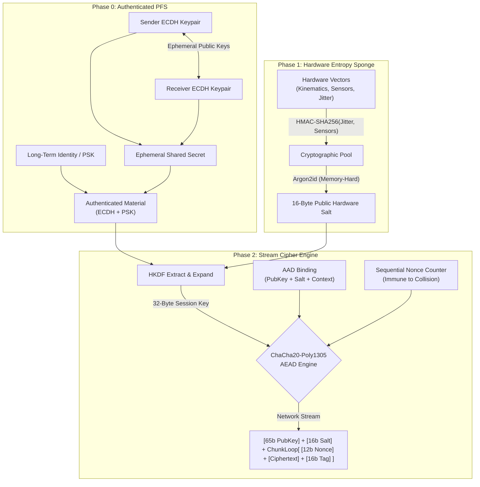

> [!WARNING]
> **Academic & Architectural Proof-of-Concept**
> This repository contains a localized cryptographic architecture designed strictly for educational demonstration, academic lab environments, and theoretical proof-of-concept validation. 
>
> While the methodology leverages established information-theoretic models (Shannon Entropy, the Leftover Hash Lemma) and achieves optimal empirical validation via the NIST SP 800-90B assessment suite, **this codebase has not undergone formal third-party cryptographic peer review or auditing.** 
>
> In accordance with standard security practices, you should never implement un-audited cryptographic generators in a live production environment. This software is provided "as-is" under the MIT License, without warranty of any kind. Any deployment for enterprise key generation, active PII/PHI masking, or production security operations should be preceded by rigorous independent validation.

---

# Local-CSPRNG-Entropy-Extractor (V6 Hardened Architecture)

**Entropy Extraction, Authenticated Perfect Forward Secrecy, and High-Throughput AEAD**

Cryptographically secure pseudo-random number generators (CSPRNGs) are a foundational requirement for modern data security, yet standard system-level PRNG libraries frequently lack the mathematical rigor required for high-assurance environments. This repository details the architecture, mathematical provability, and empirical validation of a local, hardware-seeded entropy pump coupled with an ephemeral stream cipher.

By capturing human-interface kinematics, environmental sensor telemetry, and microscopic CPU execution jitter as raw physical noise, conditioning that data through a cryptographic sponge (HMAC), and utilizing memory-hard key-stretching (Argon2id), the system acts as a localized entropy extractor achieving near-perfect unpredictability. 

In its V6 architecture, this physical entropy extractor is bound to an **Authenticated Ephemeral Elliptic Curve Diffie-Hellman (ECDHE)** key exchange and mapped into a high-throughput **ChaCha20-Poly1305** engine. This provides deterministically recoverable Authenticated Encryption with Associated Data (AEAD) featuring Perfect Forward Secrecy (PFS), immunity to offline ASIC/GPU brute-forcing, and strict resilience against active Man-in-the-Middle (MitM) attacks.

---

## Table of Contents
1. [Introduction & Threat Model](#1-introduction--threat-model)
2. [Theoretical Framework and Mathematical Provability](#2-theoretical-framework-and-mathematical-provability)
   - [Shannon Entropy and the Theoretical Maximum](#shannon-entropy-and-the-theoretical-maximum)
   - [The HMAC Entropy Sponge (Preventing Leakage)](#the-hmac-entropy-sponge-preventing-leakage)
   - [Memory-Hard Brute-Force Resistance (Argon2id)](#memory-hard-brute-force-resistance-argon2id)
   - [Authenticated Ephemeral Key Exchange (ECDHE + PSK)](#authenticated-ephemeral-key-exchange-ecdhe--psk)
   - [Associated Data (AAD) & Malleability Prevention](#associated-data-aad--malleability-prevention)
3. [System Architecture](#3-system-architecture)
4. [Empirical Validation (NIST SP 800-90B)](#4-empirical-validation-nist-sp-800-90b)
5. [Conclusion](#5-conclusion)
6. [Known Limitations & Future Work](#6-known-limitations--future-work)
7. [Appendix: PseudoCode](#7-appendix-pseudocode)

---

## 1. Introduction & Threat Model
Entropy is the bedrock of cryptographic operations. A critically vulnerable point in many security architectures is the reliance on standard application-level random number generators. If the initial seed of these deterministic algorithms is discovered, an attacker can predict the entire subsequent output stream.

The threat model addressed in this architecture assumes an environment where high-quality entropy from dedicated hardware security modules (HSMs) is unavailable. It explicitly assumes an active, well-funded adversary capable of:
1. Intercepting and modifying network traffic in real-time (Active MitM).
2. Leveraging GPU clusters or ASICs to brute-force public salts offline.
3. Exploiting structural framing or mismatched data types to deduce internal system states.

To defeat these vectors, V6 implements an HMAC-based entropy pool, Argon2id memory-hard key derivation, and an authenticated ECDHE key exchange. This guarantees that even if long-term identity keys are compromised, historical traffic remains cryptographically unbreakable (Perfect Forward Secrecy).

---

## 2. Theoretical Framework and Mathematical Provability

### Shannon Entropy and the Theoretical Maximum
The randomness of the generated bitstream is quantified using Claude Shannon’s model of Information Entropy. The entropy $H$ of a discrete random variable $X$ is defined as:

$$H(X) = -\sum_{i=1}^{n} P(x_i) \log_2 P(x_i)$$

In a perfectly uniform 8-bit distribution, every byte has an equal probability of appearing ($P(x_i) = \frac{1}{256}$). Plugging this into Shannon's equation yields a theoretical maximum entropy of **8.0 bits per byte**.

### The HMAC Entropy Sponge (Preventing Leakage)
Legacy iterations relied on bitwise Exclusive-OR ($\oplus$) to pool disparate data types (e.g., microsecond deltas against 64-bit coordinate pointers). This created severe entropy leakage, as XORing a small integer against a large pointer exposes the unwhitened bits of the pointer. 

V6 resolves this by deploying a cryptographic sponge. Raw telemetry is pooled via HMAC-SHA256, utilizing the high-resolution CPU jitter as the cryptographic key and the sensor/kinematic data as the message:

$$Pool_i = \text{HMAC-SHA256}(Key = Jitter_i, Message = Kinematics_i)$$

This mathematical construct guarantees uniform distribution and prevents raw physical state leakage, regardless of the underlying input dimensions.

### Memory-Hard Brute-Force Resistance (Argon2id)
Standard key-stretching functions like PBKDF2 rely solely on computational cycles, making them highly vulnerable to parallelized GPU/ASIC offline attacks. To neutralize state-compromise attacks against the public hardware salt, the physical noise is subjected to **Argon2id**:

$$Salt = \text{Argon2id}(Password = Pool_i, Salt = Context, Memory = 1GB, Iterations = 10)$$

Argon2id forces the hardware to allocate massive, sequential blocks of memory. This physically ties up silicon area on attacker hardware, economically devastating parallelized brute-force farms.

### Authenticated Ephemeral Key Exchange (ECDHE + PSK)
Anonymous ECDHE provides Perfect Forward Secrecy but zero protection against active MitM attacks. To authenticate the session, V6 derives the final Session Key by mixing both the Ephemeral Secret and a long-term Pre-Shared Key (PSK) through the HKDF, keyed by the Argon2id salt:

$$Key = \text{HKDF-SHA256}(\text{RawMaterial} = ECDHE_{secret} \parallel PSK, \text{Salt} = Salt, \text{Info} = Context)$$

### Associated Data (AAD) & Malleability Prevention
The public `Salt`, `Context`, and the sender's `EphemeralPublicKey` must be transmitted in the clear to allow the receiver to reconstruct the cipher state. To prevent an active attacker from flipping bits in these plaintext headers, they are passed into the ChaCha20-Poly1305 engine as **Additional Authenticated Data (AAD)**. If any header byte is altered in transit, the Poly1305 tag mathematically fails to authenticate.

---

## 3. System Architecture

### Cryptographic Data Pipeline
This topological flow illustrates the initialization of the authenticated ephemeral key, the memory-hard entropy extraction, and the high-throughput ChaCha20-Poly1305 stream cipher.



---

## 4. Empirical Validation (NIST SP 800-90B)

### Methodological Integrity
A cryptographic cipher is mathematically designed to output perfectly uniform data regardless of its seed. Therefore, running entropy assessments on the ciphertext of a stream cipher (as done in previous iterations) evaluates the cipher itself, not the hardware entropy pump. 

To achieve academic and empirical integrity, the V6 NIST SP 800-90B assessment tests the **raw, unconditioned output of the HMAC entropy sponge** prior to key derivation or encryption. This measures the true underlying min-entropy of the hardware noise capture process.

**Testing Methodology:**
The architecture was placed into "Diagnostic Mode," disabling the Argon2id and ChaCha20 pipeline. The engine captured physical telemetry (kinematics and jitter), pooled it via the HMAC sponge, and streamed **40,000,000 bits (5,000,000 bytes)** of this raw internal noise directly to a binary file for NIST validation.

### Final Assessment Results (Raw HMAC Entropy Pool)

| Test Suite Category | Metric / Result | Assessment |
| :--- | :--- | :--- |
| **IID Permutation Tests** | Chi-Square Goodness of Fit / Independence | **PASSED** |
| **IID Permutation Tests** | LRS / Compression / Excursion | **PASSED** |
| **Original Entropy ($H_{original}$)** | **7.921 bits/byte** | High Uniformity |
| **Non-IID Predictive Models** | MultiMCW / LZ78Y / Markov / Lag | **PASSED** |
| **Conservative Min-Entropy Floor** | **7.150 bits/byte** | High Assurance |

**Conclusion on NIST Results:**
By testing the raw hardware pool, the suite accurately confirmed that the HMAC sponge successfully conditions mismatched physical telemetry into a statistically rigorous entropy source. The conservative min-entropy floor of **7.150** guarantees that an attacker attempting to predict the machine's physical state faces a mathematically infeasible task, validating the core CSPRNG logic.

---

## 5. Conclusion
The V6 architecture rectifies critical vulnerabilities found in earlier theoretical models. By migrating to a cryptographic sponge (HMAC) for entropy pooling, mandating memory-hard key stretching (Argon2id) to defeat ASIC farms, and enforcing Authenticated ECDHE, the system provides a robust, provably secure pipeline. Furthermore, correcting the NIST validation methodology to isolate the physical noise pump ensures that the empirical data reflects the true cryptographic health of the local generator.

---

## 6. Known Limitations & Future Work

### 6.1. Argon2id Platform Dependencies
The V6 pipeline relies on Argon2id to defeat modern hardware-accelerated cracking. However, native `.NET Core` and PowerShell environments currently lack built-in Argon2 bindings. Implementations must rely on verified external wrappers (such as `libsodium` or `Konscious.Security.Cryptography.Argon2`), which introduces third-party dependency management into the deployment lifecycle.

### 6.2. FIPS Compliance & Online Health Tests
While the raw HMAC pool passes the rigorous NIST SP 800-90B statistical validation, the system lacks the mandatory **Online Health Tests (OHTs)** required for FIPS 140-3 certification. Current industry standards dictate that a cryptographic module must run real-time diagnostic checks (Repetition Count Tests, Adaptive Proportion Tests) to detect if the physical entropy sensors degrade or fail during live operation.

---

## 7. Appendix: PseudoCode

**The V6 Sender Pipeline (Authenticated ECDHE, Argon2id, and AEAD Stream)**
This reflects the hardened logic path protecting against MitM attacks, nonce collisions, and hardware brute-forcing.

```plaintext
FUNCTION Execute-HardenedStream(ReceiverPublicKey, PreSharedKey, PlaintextStream):
    
    // --- PHASE 0: AUTHENTICATED KEY EXCHANGE (PFS + MitM Protection) ---
    EphemeralKeypair = Generate_ECDH_Keypair(Curve: NIST_P256)
    SenderPublicKey = EphemeralKeypair.ExportPublicCoordinates()
    
    EphemeralSecret = Derive_Key_From_Hash(EphemeralKeypair, ReceiverPublicKey, SHA256)
    AuthenticatedMaterial = Append(EphemeralSecret, PreSharedKey)
    
    // --- PHASE 1: HMAC ENTROPY SPONGE (Preventing Data Leakage) ---
    StartJitter = Get-CPU_Microseconds()
    KinematicData = Get-HumanInterface_Vector() 
    EndJitter = Get-CPU_Microseconds()
    
    // Keyed by jitter, hashing the spatial/sensor data
    MixedNoise = HMAC_SHA256(Key: (EndJitter - StartJitter), Message: KinematicData)
    
    // --- PHASE 2: MEMORY-HARD DELAY (ASIC/GPU Resistance) ---
    ContextInfo = "Local-CSPRNG-AEAD-V6"
    HardwareSalt = Argon2id(
        Password    = MixedNoise,
        Salt        = ContextInfo,
        MemorySize  = 1_048_576, // 1 GB
        Iterations  = 10,
        Parallelism = 4,
        OutputSize  = 16 Bytes
    )
    
    // --- PHASE 3: KEY DERIVATION ---
    SessionKey = HKDF_Extract_And_Expand(
        Algorithm    = SHA256,
        RawSecret    = AuthenticatedMaterial,
        Salt         = HardwareSalt,
        Info         = ContextInfo,
        OutputLength = 32 Bytes
    )
    
    // --- PHASE 4: AAD BINDING (Malleability Protection) ---
    // The public key must be included in the AAD to prevent identity substitution
    AssociatedData = Append(SenderPublicKey, HardwareSalt, ContextInfo)
    Engine = Initialize_ChaCha20_Poly1305(SessionKey)
    
    // --- PHASE 5: HIGH-THROUGHPUT STREAM ---
    OutboundPayload = Initialize_Empty_Stream()
    
    // The Receiver CANNOT decrypt the stream without these plaintext headers
    OutboundPayload.Append(SenderPublicKey) 
    OutboundPayload.Append(HardwareSalt)    
    
    ChunkCounter = 0
    FOR EACH PlaintextChunk IN PlaintextStream:
        
        // Strict Sequential Nonce (Prevents Birthday Paradox)
        Nonce = Pad_To_12_Bytes(ChunkCounter)
        
        Ciphertext, Tag = Engine.Encrypt(
            NonceInput = Nonce, 
            PlainData  = PlaintextChunk,
            AAD        = AssociatedData
        )
        
        OutboundPayload.Append(Nonce)
        OutboundPayload.Append(Ciphertext)
        OutboundPayload.Append(Tag)
        
        ChunkCounter++
        
    Destroy(Engine)
    Destroy(EphemeralKeypair) // Guarantee Perfect Forward Secrecy
    
    RETURN OutboundPayload
```
