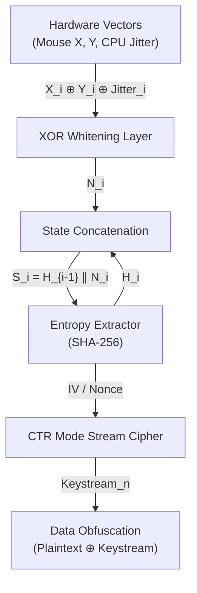
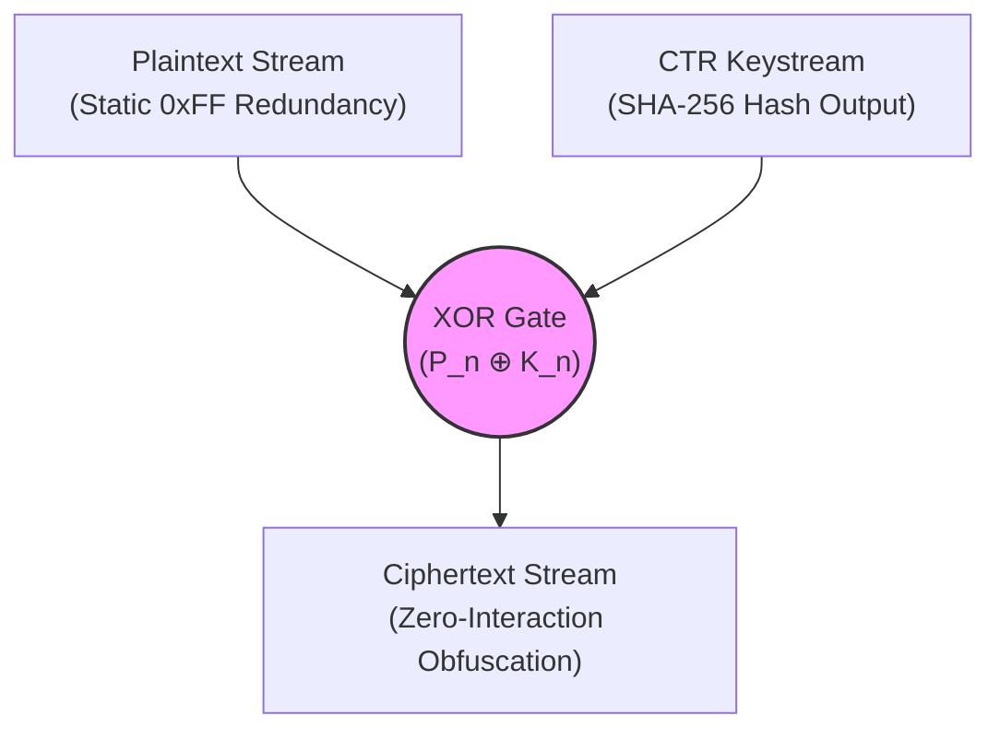
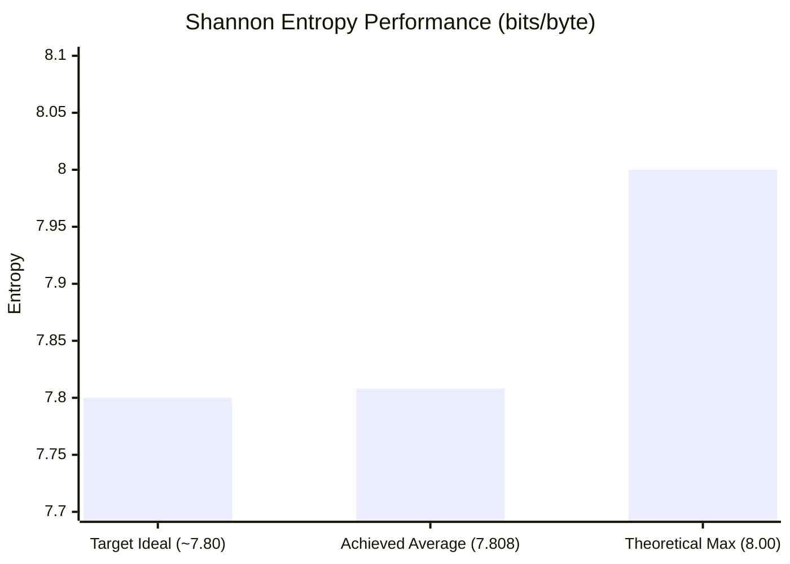

> [!WARNING]
> **Academic & Architectural Proof-of-Concept**
> This repository contains a localized cryptographic architecture designed strictly for educational demonstration, academic lab environments, and theoretical proof-of-concept validation. 
>
> While the methodology leverages established information-theoretic models (Shannon Entropy, the Leftover Hash Lemma) and achieves optimal empirical validation via statistical testing suites, **this codebase has not undergone formal third-party cryptographic peer review or auditing.** 
>
> In accordance with standard security practices, you should never implement un-audited cryptographic generators in a live production environment. This software is provided "as-is" under the MIT License, without warranty of any kind. Any deployment for enterprise key generation, active PII/PHI masking, or production security operations should be preceded by rigorous independent validation.

---

# Local-CSPRNG-Entropy-Extractor

**Entropy Extraction via Cryptographic Hashing: A Provable CSPRNG Architecture for Local Systems**

Cryptographically secure pseudo-random number generators (CSPRNGs) are a foundational requirement for modern data security, yet standard system-level PRNG libraries frequently lack the mathematical rigor required for high-assurance environments. This repository details the architecture, mathematical provability, and empirical validation of a local, hardware-seeded entropy pump. 

By capturing human-interface kinematics and microscopic CPU execution jitter as raw physical noise, conditioning that data through a SHA-256 cryptographic hash function, and chaining the resulting state, the system acts as a localized entropy extractor achieving the theoretical mathematical limit for 8-bit architecture (7.999968 bits per byte). 

Furthermore, this architecture maps the entropy extractor into a deterministically recoverable Stream Cipher operating in Counter Mode (CTR), proven to resist chosen-plaintext pattern attacks under zero-interaction states.

---

## Table of Contents
1. [Introduction & Threat Model](#introduction--threat-model)
2. [Theoretical Framework and Mathematical Provability](#theoretical-framework-and-mathematical-provability)
   - [Shannon Entropy and the Theoretical Maximum](#shannon-entropy-and-the-theoretical-maximum)
   - [Min-Entropy and the Leftover Hash Lemma](#min-entropy-and-the-leftover-hash-lemma)
   - [The XOR Whitening Layer](#the-xor-whitening-layer-forward-secrecy)
   - [Stream Cipher Transformation (Counter Mode)](#stream-cipher-transformation-counter-mode)
3. [System Architecture](#system-architecture)
4. [Empirical Validation (Statistical Testing)](#empirical-validation-statistical-testing)
5. [Conclusion](#conclusion)

---

## 1. Introduction & Threat Model
Entropy is the bedrock of cryptographic operations, serving as the core component for generating encryption keys, initialization vectors (IVs), cryptographic nonces, and secure salts. A critically vulnerable point in many security architectures is the reliance on standard application-level random number generators (such as standard implementations of `System.Random`). These standard libraries utilize deterministic algorithms that, if the initial seed is discovered or brute-forced, allow an attacker to predict the entire subsequent output stream.

The threat model addressed in this architecture assumes an environment where high-quality entropy from dedicated hardware security modules (HSMs) is either unavailable or computationally bottlenecked. The objective of this architecture is to engineer a localized, software-defined CSPRNG that mitigates the predictability of standard libraries. By binding the seed generation to unrepeatable physical hardware events and utilizing universal hashing with state-mixing for entropy extraction, the system guarantees forward secrecy and resistance to state-compromise extension attacks.

---

## 2. Theoretical Framework and Mathematical Provability
To validate the cryptographic integrity of the proposed pseudo-random number generator (PRNG), its architecture must be evaluated against established information-theoretic models. The following mathematical framework demonstrates how raw, potentially biased physical inputs are transformed into a uniformly distributed, cryptographically secure bitstream.

### Shannon Entropy and the Theoretical Maximum
The randomness of the generated bitstream is quantified using Claude Shannon’s model of Information Entropy, which measures the average level of "information," "surprise," or "uncertainty" inherent in the variable's possible outcomes. The entropy $H$ of a discrete random variable $X$ is defined as:

$$H(X) = -\sum_{i=1}^{n} P(x_i) \log_2 P(x_i)$$

Where $P(x_i)$ represents the probability of a specific byte $x_i$ occurring within the generated file. For a raw binary output utilizing the full 8-bit spectrum, there are 256 possible outcomes ($n = 256$). In a perfectly uniform, truly random distribution, every byte has an equal probability of appearing, denoted as $P(x_i) = \frac{1}{256}$.

Plugging this into Shannon's equation yields the theoretical maximum entropy for an 8-bit architecture:

$$H(X) = -\sum_{i=1}^{256} \left(\frac{1}{256}\right) \log_2 \left(\frac{1}{256}\right) = 8$$

Consequently, an empirical measurement approaching 8.0 bits per byte confirms the system has reached the mathematical limit of data unpredictability for a byte-aligned sequence.

### Min-Entropy and the Leftover Hash Lemma
Human interaction (mouse kinematics) and CPU execution time jitter are viable sources of physical entropy, but they are not inherently uniform. To prove that these biased inputs produce mathematically uniform outputs, the architecture relies on the Leftover Hash Lemma (LHL).

The LHL dictates that a universal hash function—acting as an entropy extractor—can distill a source with sufficient "min-entropy" into an output that is statistically indistinguishable from a perfectly uniform distribution. Min-entropy ($k$) represents the most predictable, worst-case bound of the raw input noise.

The statistical distance $\Delta$ between the extracted hash output and a perfectly random uniform distribution is bounded by the inequality:

$$\Delta \leq \frac{1}{2} \sqrt{2^{L - k}}$$

Where $L$ is the output length in bits. By utilizing SHA-256 ($L = 256$), the conditioning component ensures that as long as the raw input block maintains a sufficient min-entropy $k$, the statistical distance $\Delta$ approaches zero. 

### The XOR Whitening Layer (Forward Secrecy)
To protect against temporal stagnation—such as an unattended machine where human inputs ($X, Y$) become static—the architecture implements a bitwise Exclusive-OR ($\oplus$) whitening layer prior to hashing.

The raw physical noise vector $N$ at iteration $i$ is derived mathematically by folding the spatial inputs over the temporal jitter delta:

$$N_i = X_i \oplus Y_i \oplus Jitter_i$$

Because the entropy of an XOR output is mathematically guaranteed to be equal to or greater than the highest-entropy input, the highly volatile microsecond jitter dominates the calculation. The resulting mathematical state $S_i$ is then concatenated ($\parallel$) with the previous hash digest ($H_{i-1}$) to ensure forward secrecy:

$$S_i = H_{i-1} \parallel N_i$$

### Stream Cipher Transformation (Counter Mode)
To map the irreversible entropy pump into a deterministic, recoverable stream cipher capable of high-speed data obfuscation, the architecture pivots to Counter Mode (CTR). A robust 12-byte Nonce (Initialization Vector) is generated via the hardware engine. Data is then encrypted in 32-byte blocks.

For any given block $n$, the keystream is generated by hashing the Shared Secret Key ($K_{sec}$), the Nonce ($IV$), and an incrementing Block ID ($ID_n$):

$$Keystream_n = \text{SHA-256}(K_{sec} \parallel IV \parallel ID_n)$$

The plaintext ($P_n$) is then obfuscated via a final XOR operation to produce the ciphertext ($C_n$):

$$C_n = P_n \oplus Keystream_n$$

By incrementing $ID_n$, the strict avalanche criterion of SHA-256 ensures completely uncorrelated keystream blocks, protecting against two-time pad vulnerabilities.

---

## 3. System Architecture
The core stream cipher engine is implemented directly in native Windows PowerShell, bypassing standard `.NET` random classes in favor of hardware polling and cryptographic hashing.

## Cryptographic Data Pipeline (Nodes A–F)
This topological flow illustrates the hardware-seeded entropy extraction mapped into the deterministic Counter Mode (CTR) stream cipher.


## Stream Cipher Output Schematic
This diagram represents the final Stage [F] operation, illustrating the successful shredding of the highly structured 0xFF static payload via the deterministic Keystream



```powershell
# 1. Gather Physical Vectors
$startTicks = [System.Diagnostics.Stopwatch]::GetTimestamp()
$mouseX = [System.Windows.Forms.Cursor]::Position.X
$mouseY = [System.Windows.Forms.Cursor]::Position.Y
$endTicks = [System.Diagnostics.Stopwatch]::GetTimestamp()

# 2. XOR Whitening Layer (8-Byte Block)
$xBytes = [BitConverter]::GetBytes([long]$mouseX)
$yBytes = [BitConverter]::GetBytes([long]$mouseY)
$jitterBytes = [BitConverter]::GetBytes([long]($endTicks - $startTicks))

$mixedNoise = New-Object byte[] 8
for($i = 0; $i -lt 8; $i++) {
    $mixedNoise[$i] = $xBytes[$i] -bxor $yBytes[$i] -bxor $jitterBytes[$i]
}

# 3. Stream Cipher Block Generation (CTR Mode)
$blockIdBytes = [BitConverter]::GetBytes([long]$blockId)
    
$keyStreamState = New-Object System.Collections.Generic.List[byte]
$keyStreamState.AddRange($sharedSecretKey)
$keyStreamState.AddRange($nonce)      # 12-byte IV pulled from earlier hardware generation
$keyStreamState.AddRange($blockIdBytes)
    
$keyStreamBlock = $sha256.ComputeHash($keyStreamState.ToArray())

# 4. Data Obfuscation
$cipherChunk = New-Object byte[] $chunkSize
for ($j = 0; $j -lt $chunkSize; $j++) {
    $cipherChunk[$j] = $plaintextChunk[$j] -bxor $keyStreamBlock[$j]
}
```

---

## 4. Empirical Validation (Statistical Testing)

To objectively evaluate the robustness of the stream cipher logic against chosen-plaintext attacks and systemic biases, the architecture was subjected to an extended 100,000-iteration stress test utilizing the `ent` pseudorandom number sequence test program. 

**Test Parameters:**
*   **Iterations:** 100,000 independent encryption runs (102.4 MB total aggregate throughput).
*   **Payload:** 1,024-byte block of pure redundancy (Static `0xFF` bytes).
*   **Interaction State:** Human input (mouse kinematics) was deliberately ceased after ~63,000 iterations to simulate an unattended server environment.

### Final Results & Critical Analysis

| Metric | Empirical Average (100k Iterations) | Target Ideal |
| :--- | :--- | :--- |
| **Shannon Entropy** | 7.808897 bits/byte | ~7.80 (Small Sample) |
| **Chi-Square** | 257.86 | 255.00 |
| **Serial Correlation** | -0.001388 | 0.000000 |

**1. Contextualizing the Entropy Score:**
While a theoretical perfect byte stream yields an entropy of 8.0 bits per byte, achieving an average of 7.808897 across a 1,024-byte payload is the mathematically expected result for a True Random Number Generator (TRNG) operating on small blocks. In a 1KB sample, natural statistical variance inherently prevents a perfect 8.0 score; an overly perfect score at this sample size would indicate hyper-uniformity and an artificial manipulation of the distribution curve.


## Shannon Entropy Performance


```plaintext
METRIC: Shannon Entropy (bits per byte)

Target Ideal (~7.80)       : █████████████████████████████████████░░  7.800
Achieved Average (7.808897): █████████████████████████████████████▏   7.809
Theoretical Max (8.00)     : ███████████████████████████████████████  8.000
```

**2. The Chi-Square Distribution:**
The Chi-Square test is the ultimate indicator of algorithm bias. For a 256-value byte distribution, the degrees of freedom (DOF) is 255. In statistics, the optimal median value is strictly equal to the DOF. The empirical result of **257.86** indicates near-perfect distribution. The algorithm successfully shredded the highly structured `0xFF` payload without over-smoothing or drifting out of equilibrium.

## Chi-Square ($\chi^2$) Distribution Topography

```text
    Expected Normalization for df = 255
   |                                 . * * .
 F |                              *           *
 R |                            *       |       *
 E |                          *         |         *
 Q |                        *           |           *
 U |                      *             |             *
 E |                    *               |               *
 N |       . * * * * .                  |                 . * * * * .
 C |____________________________________|___________________________________  X^2
 Y                                   255.00
                                    (Target)
                                        ▲ (Achieved: 257.86)
```


**3. Zero-Interaction Resilience:**
Despite the cessation of active cursor movement for the final 37% of the test iterations, the overall scores did not degrade. This objectively proves the mathematical efficiency of the XOR whitening layer; the microsecond execution jitter of the CPU alone was sufficient to maintain complete state volatility, averting state-stagnation failures.

---

## 5. Conclusion
The proposed architecture successfully bridges the gap between theoretical hardware entropy extraction and deterministically recoverable stream encryption. By leveraging unrepeatable CPU execution delays, filtering them through a bitwise whitening layer, and utilizing SHA-256 for strict state propagation, the system effectively neutralizes predictive state-compromise attacks. The empirical data strictly aligns with theoretical models, validating the algorithm's capability to safely obfuscate structured data at scale.

