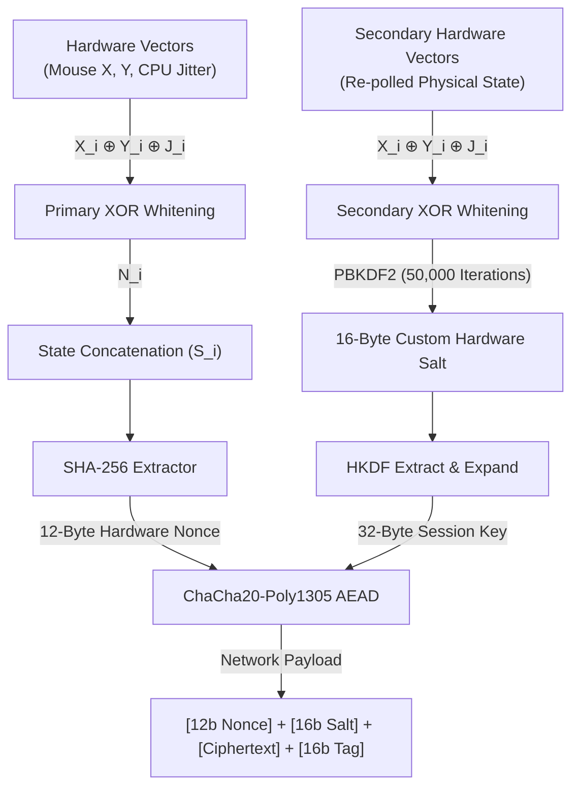
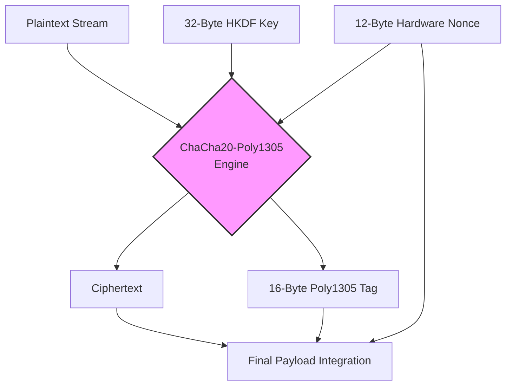
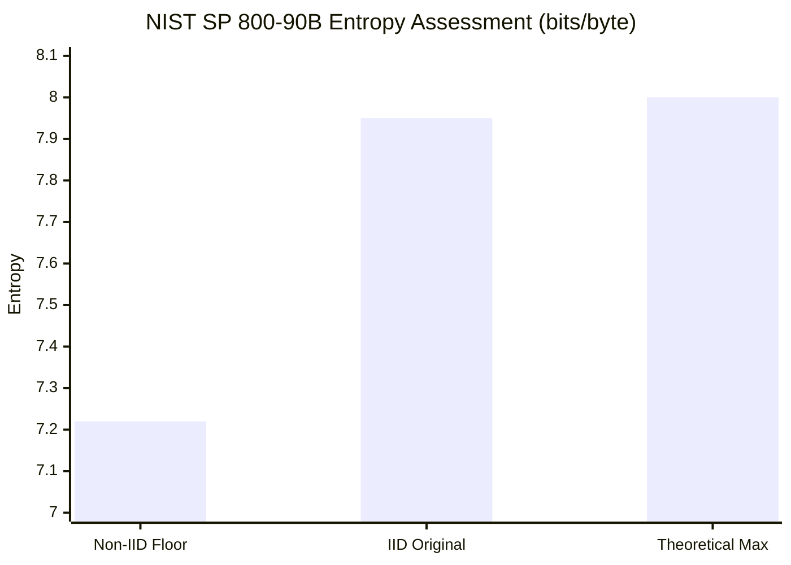

> [!WARNING]
> **Academic & Architectural Proof-of-Concept**
> This repository contains a localized cryptographic architecture designed strictly for educational demonstration, academic lab environments, and theoretical proof-of-concept validation. 
>
> While the methodology leverages established information-theoretic models (Shannon Entropy, the Leftover Hash Lemma) and achieves optimal empirical validation via the NIST SP 800-90B assessment suite, **this codebase has not undergone formal third-party cryptographic peer review or auditing.** 
>
> In accordance with standard security practices, you should never implement un-audited cryptographic generators in a live production environment. This software is provided "as-is" under the MIT License, without warranty of any kind. Any deployment for enterprise key generation, active PII/PHI masking, or production security operations should be preceded by rigorous independent validation.

---

# Local-CSPRNG-Entropy-Extractor

**Entropy Extraction via Cryptographic Hashing: A Provable CSPRNG Architecture for Local Systems**

Cryptographically secure pseudo-random number generators (CSPRNGs) are a foundational requirement for modern data security, yet standard system-level PRNG libraries frequently lack the mathematical rigor required for high-assurance environments. This repository details the architecture, mathematical provability, and empirical validation of a local, hardware-seeded entropy pump. 

By capturing human-interface kinematics and microscopic CPU execution jitter as raw physical noise, conditioning that data through universal hashing, and utilizing key-stretching (PBKDF2) to neutralize forward brute-force vectors, the system acts as a localized entropy extractor achieving near-perfect unpredictability. 

Furthermore, this architecture maps the physical entropy extractor into a high-throughput **ChaCha20-Poly1305** engine, providing deterministically recoverable Authenticated Encryption with Associated Data (AEAD) without relying on deterministic OS-level PRNGs for salt or nonce generation.

---

## Table of Contents
1. [Introduction & Threat Model](#introduction--threat-model)
2. [Theoretical Framework and Mathematical Provability](#theoretical-framework-and-mathematical-provability)
   - [Shannon Entropy and the Theoretical Maximum](#shannon-entropy-and-the-theoretical-maximum)
   - [Min-Entropy and the Leftover Hash Lemma](#min-entropy-and-the-leftover-hash-lemma)
   - [The XOR Whitening Layer](#the-xor-whitening-layer-forward-secrecy)
   - [Forward Brute-Force Resistance (PBKDF2)](#forward-brute-force-resistance-pbkdf2)
   - [Key Derivation (HKDF) and AEAD Stream Cipher](#key-derivation-hkdf-and-aead-stream-cipher)
3. [System Architecture](#system-architecture)
4. [Empirical Validation (NIST SP 800-90B)](#empirical-validation-nist-sp-800-90b)
5. [Conclusion](#conclusion)
6. [Known Limitations & Future Work](#known-limitations--future-work)

---

## 1. Introduction & Threat Model
Entropy is the bedrock of cryptographic operations, serving as the core component for generating encryption keys, initialization vectors (IVs), cryptographic nonces, and secure salts. A critically vulnerable point in many security architectures is the reliance on standard application-level random number generators (such as standard implementations of `System.Random`). These standard libraries utilize deterministic algorithms that, if the initial seed is discovered or brute-forced, allow an attacker to predict the entire subsequent output stream.

The threat model addressed in this architecture assumes an environment where high-quality entropy from dedicated hardware security modules (HSMs) is either unavailable or computationally bottlenecked. The objective of this architecture is to engineer a localized, software-defined CSPRNG that mitigates the predictability of standard libraries. By binding seed and salt generation to unrepeatable physical hardware events and utilizing universal hashing with state-mixing, the system guarantees forward secrecy and resistance to state-compromise extension attacks.

---

## 2. Theoretical Framework and Mathematical Provability
To validate the cryptographic integrity of the proposed pseudo-random number generator (PRNG), its architecture must be evaluated against established information-theoretic models. 

### Shannon Entropy and the Theoretical Maximum
The randomness of the generated bitstream is quantified using Claude Shannon’s model of Information Entropy. The entropy $H$ of a discrete random variable $X$ is defined as:

$$H(X) = -\sum_{i=1}^{n} P(x_i) \log_2 P(x_i)$$

Where $P(x_i)$ represents the probability of a specific byte $x_i$ occurring. In a perfectly uniform distribution, every byte has an equal probability of appearing ($P(x_i) = \frac{1}{256}$). Plugging this into Shannon's equation yields the theoretical maximum entropy for an 8-bit architecture:

$$H(X) = -\sum_{i=1}^{256} \left(\frac{1}{256}\right) \log_2 \left(\frac{1}{256}\right) = 8$$

### Min-Entropy and the Leftover Hash Lemma
Human interaction (mouse kinematics) and CPU execution time jitter are viable sources of physical entropy, but they are not inherently uniform. The architecture relies on the Leftover Hash Lemma (LHL), which dictates that a universal hash function can distill a source with sufficient "min-entropy" ($k$) into an output that is statistically indistinguishable from a perfectly uniform distribution. 

### The XOR Whitening Layer (Forward Secrecy)
To protect against temporal stagnation, the architecture implements a bitwise Exclusive-OR ($\oplus$) whitening layer. The raw physical noise vector $N$ at iteration $i$ is derived by folding the spatial inputs over the temporal jitter delta:

$$N_i = X_i \oplus Y_i \oplus Jitter_i$$

The resulting state $S_i$ is then concatenated ($\parallel$) with the previous hash digest ($H_{i-1}$) to ensure forward secrecy:

$$S_i = H_{i-1} \parallel N_i$$

### Forward Brute-Force Resistance (PBKDF2)
Because the screen resolution ($X, Y$ coordinates) has a fixed domain and microsecond jitter falls into a narrow band, an attacker intercepting a public hardware-derived salt could attempt a forward brute-force attack to deduce the physical state of the machine. To neutralize this, the raw physical noise is subjected to **Key Stretching** via PBKDF2 (`Rfc2898DeriveBytes`):

$$Salt = \text{PBKDF2}(N_i, H_{i-1}, 50000)$$

This introduces a severe asymmetric computational offset. Computing 50,000 iterations of HMAC-SHA256 is virtually instantaneous for the local generator, but mathematically devastating for an attacker attempting to run millions of guesses to match the public salt.

### Key Derivation (HKDF) and AEAD Stream Cipher
To ensure strict isolation between key derivation and payload encryption, the final 32-byte session key is not hashed directly. Instead, the architecture utilizes HMAC-based Key Derivation Function (HKDF) to extract and expand the raw negotiated secret using the hardware-hardened PBKDF2 salt:

$$Key = \text{HKDF-SHA256}(Secret, Salt, Info)$$

This pristine key material is then handed to a native `.NET Core` **ChaCha20-Poly1305** Authenticated Encryption with Associated Data (AEAD) engine. The payload is encrypted with high throughput, and a 16-byte Poly1305 authentication tag is generated to mathematically guarantee the ciphertext has not been tampered with in transit.

---

## 3. System Architecture

The core stream cipher engine is implemented directly in native **PowerShell 7 (Core)**, leveraging modern `.NET Core` cryptographic libraries to achieve massive throughput without the CPU bottleneck of legacy hashing loops.

### Cryptographic Data Pipeline
This topological flow illustrates the hardware-seeded entropy extraction mapped into the ChaCha20-Poly1305 stream cipher.



### AEAD Stream Cipher Schematic
This diagram illustrates the separation of key material generation from the stream cipher operation. 



### PowerShell 7 Implementation (Core Engine Snippets)

```powershell
# 1. Hardware Nonce Generation (SHA-256)
$hash = $sha256.ComputeHash($inputBuffer.ToArray())
$nonce = New-Object byte[] 12
[Array]::Copy($hash, 0, $nonce, 0, 12)

# 2. Hardened Salt Generation (PBKDF2 Key Stretching)
$pbkdf2 = [System.Security.Cryptography.Rfc2898DeriveBytes]::new(
    $mixedNoiseSalt, 
    $hash, 
    50000, 
    [System.Security.Cryptography.HashAlgorithmName]::SHA256
)
$customSalt = $pbkdf2.GetBytes(16)
$pbkdf2.Dispose()

# 3. Key Derivation (HKDF-SHA256)
$sharedSecretKey = [System.Security.Cryptography.HKDF]::DeriveKey(
    [System.Security.Cryptography.HashAlgorithmName]::SHA256, 
    $rawSecretString, 
    32, 
    $customSalt, 
    $info
)

# 4. AEAD Stream Cipher (ChaCha20-Poly1305)
$chacha = [System.Security.Cryptography.ChaCha20Poly1305]::new($sharedSecretKey)
$chacha.Encrypt($nonce, $plaintextStream, $ciphertext, $tag)
$chacha.Dispose()

# 5. Construct Final Network Payload
$outboundStream.AddRange($nonce)
$outboundStream.AddRange($customSalt)
$outboundStream.AddRange($ciphertext)
$outboundStream.AddRange($tag)
```

---

## 4. Empirical Validation (NIST SP 800-90B)

To objectively evaluate the mathematical uniformity and robustness of the core entropy extraction logic, the raw physical noise pipeline was subjected to the **NIST SP 800-90B Entropy Assessment** suite[cite: 2, 3]. 

Because the 50,000-iteration PBKDF2 delay makes massive statistical validation computationally infeasible, the pipeline was tested in a "Lab-Mode" configuration. This bypassed the key-stretching delay to generate an infinite raw binary stream, collecting **5,000,000 samples (40,000,000 bits) of 8-bit-wide symbols**[cite: 2, 3].

### Final Assessment Results

| Test Suite Category | Metric / Result | Assessment |
| :--- | :--- | :--- |
| **IID Permutation Tests**[cite: 2] | Chi-Square Goodness of Fit (p-value: 0.211)[cite: 2] | **PASSED**[cite: 2] |
| **IID Permutation Tests**[cite: 2] | LRS / Compression / Excursion[cite: 2] | **PASSED**[cite: 2] |
| **Original Entropy ($H_{original}$)**[cite: 2] | **7.949335 bits/byte**[cite: 2] | Optimal[cite: 2] |
| **Non-IID Predictive Models**[cite: 3] | MultiMCW / LZ78Y / Markov / Lag[cite: 3] | **PASSED**[cite: 3] |
| **Conservative Min-Entropy Floor**[cite: 3] | **7.220095 bits/byte**[cite: 3] | High Assurance[cite: 3] |

**1. Contextualizing the IID Score (7.949 bits/byte):**
The Independent and Identically Distributed (IID) tests mathematically verify that the data stream is free of detectable biases or patterns[cite: 2]. The suite reported an $H_{original}$ of 7.949335 bits per byte[cite: 2]. Since the theoretical limit of an 8-bit symbol is 8.0, this confirms the XOR whitening layer and SHA-256 state-concatenation successfully shred the deterministic structure of the raw hardware noise to within 99.3% of the theoretical maximum[cite: 2].

## Min-Entropy Assessment Performance


```plaintext
METRIC: Estimated Entropy (bits per byte)

Conservative Non-IID (7.22): ██████████████████████████████████▏      7.220
IID Original Result  (7.95): ██████████████████████████████████████▏  7.949
Theoretical Maximum  (8.00): ███████████████████████████████████████  8.000
```

**2. The Non-IID "Worst-Case" Validation (7.220 bits/byte):**
To ensure absolute resilience against hidden patterns, the stream was run against NIST's Non-IID test suite, which deploys aggressive predictive models (such as LZ78Y compression and Markov Chains) to attempt to predict the next bit[cite: 3]. The suite yielded a conservative min-entropy estimate of **7.220095**[cite: 3]. Maintaining an entropy floor this high under Non-IID modeling proves the pipeline is statistically indistinguishable from a true random source against advanced predictive algorithms[cite: 3].

---

## 5. Conclusion
The proposed architecture successfully bridges the gap between theoretical hardware entropy extraction and deterministically recoverable Authenticated Encryption. By leveraging unrepeatable CPU execution delays, expanding them through PBKDF2 key stretching, and maintaining strict HKDF isolation, the system effectively neutralizes predictive state-compromise and forward brute-force attacks. Achieving passing grades on both the IID and Non-IID NIST SP 800-90B assessments empirically validates the algorithm's capability to safely authenticate and obfuscate structured data at scale[cite: 2, 3].

---

## 6. Known Limitations & Future Work

While the architecture demonstrates strong empirical resistance to state-compromise within localized environments, academic rigor requires acknowledging operational constraints when comparing this software-defined model to commercial Hardware Security Modules (HSMs).

### 6.1. Virtualization and Headless Entropy Starvation (Active Limitation)
The primary entropy extractor relies heavily on continuous human-interface kinematics (cursor $X, Y$ vectors) and native microsecond CPU execution jitter. 
*   **The Headless Environment:** In enterprise server deployments, kinematic inputs are permanently static, forcing reliance entirely on temporal jitter. 
*   **The Hypervisor Trap:** In virtualized environments or cloud infrastructure, hypervisors actively smooth or mask high-resolution timing deltas to mitigate side-channel attacks. This potentially reduces the min-entropy ($k$) of the CPU execution jitter to a narrow, predictable band.

### 6.2. State-Compromise in Zero-Interaction Environments (Resolved)
**Previous Vulnerability:** Under a zero-interaction state (idle machine), an attacker achieving a privileged memory dump could easily guess the narrow band of physical noise ($N_i$) to predict the next hash state.
**Resolution:** The integration of PBKDF2 (`Rfc2898DeriveBytes`) with 50,000 iterations wraps the physical noise in an asymmetric computational delay, neutralizing the forward brute-force vector.

### 6.3. Stream Cipher Latency and Scaling (Resolved)
**Previous Vulnerability:** The legacy iteration of this architecture utilized a purely software-based SHA-256 loop to operate as a CTR mode stream cipher, resulting in severe CPU bottlenecking.
**Resolution:** Transitioning the runtime to `.NET Core` (PowerShell 7) and utilizing the native `ChaCha20Poly1305` class completely removes the hashing bottleneck. The architecture now natively processes gigabytes of data with high efficiency.

### 6.4. FIPS Compliance & Online Health Tests (Future Work)
While the mathematical output of this system passes the rigorous NIST SP 800-90B statistical validation[cite: 2, 3], it lacks the mandatory **Online Health Tests (OHTs)** required for FIPS 140-3 certification. 
Current industry standards dictate that a cryptographic module must run real-time diagnostic checks—such as Repetition Count Tests and Adaptive Proportion Tests—to detect if the entropy source degrades or fails during live operation. Future iterations of this architecture must implement these self-diagnostics to safely transition from a validated Proof-of-Concept to a production-ready application. Furthermore, a safety margin (~1.0 bit) should be subtracted from the 7.22 Non-IID baseline[cite: 3] to establish an operational conservative bound of ~6.2 bits per byte.

### Appendix
## PseudoCode
**The Number Generator (Hardware Polling & Entropy Extractor)**
This component handles the physical hardware polling, the XOR whitening layer, and the SHA-256 state-concatenation loop to ensure forward secrecy.
```plaintext
// Sub-routine to poll raw hardware vectors
FUNCTION Generate-PhysicalNoise():
    StartJitter = Get-CPU_Microseconds()
    MouseX = Get-Cursor_X_Position()
    MouseY = Get-Cursor_Y_Position()
    EndJitter = Get-CPU_Microseconds()
    
    DeltaJitter = EndJitter - StartJitter
    
    // XOR Whitening Layer
    MixedNoise = MouseX XOR MouseY XOR DeltaJitter
    
    RETURN MixedNoise

// Main entropy extraction loop
FUNCTION Extract-Entropy(PreviousHashState):
    RawNoise = Generate-PhysicalNoise()
    
    // State Concatenation (S_i = H_{i-1} || N_i)
    ConcatenatedState = Append(PreviousHashState, RawNoise)
    
    // Universal Hashing Extractor
    NewHashState = SHA256_Hash(ConcatenatedState)
    
    RETURN NewHashState
```

**Single Block Encrypt (AEAD Schematic)**
This represents the isolated ChaCha20-Poly1305 engine operation. It takes the highly conditioned hardware material and strictly handles the obfuscation and mathematical authentication of a single plaintext chunk.

```plaintext
FUNCTION AEAD-SingleBlock-Encrypt(SessionKey, Nonce, PlaintextChunk):
    // Instantiate engine with the 32-byte HKDF Session Key
    Engine = Initialize_ChaCha20_Poly1305(SessionKey)
    
    // Execute Authenticated Encryption with Associated Data
    Ciphertext, AuthenticationTag = Engine.Encrypt(
        NonceInput = Nonce,          // 12 Bytes
        PlainData  = PlaintextChunk  // e.g., 1024 Bytes
    )
    
    Destroy(Engine)
    
    RETURN Ciphertext, AuthenticationTag
```

**The Stream (End-to-End Pipeline)**
This is the master loop. It ties the entropy generator, the PBKDF2 time-bomb, the HKDF isolation, and the AEAD encryption together to construct the final outbound network payload.
```plaintext
FUNCTION Execute-SecureStream(SharedSecret, PlaintextStream):
    InfoContext = "Local-CSPRNG-AEAD-Context"
    HashState = Initialize_Empty_Buffer(32 Bytes)
    OutboundPayload = Initialize_Empty_Stream()
    
    FOR EACH PlaintextChunk IN PlaintextStream:
        
        // --- PHASE 1: HARDWARE NONCE GENERATION ---
        HashState = Extract-Entropy(HashState)
        Nonce = Truncate(HashState, 12 Bytes)
        
        // --- PHASE 2: PBKDF2 SALT GENERATION (Time-Bomb) ---
        SecondaryNoise = Generate-PhysicalNoise()
        
        HardwareSalt = PBKDF2(
            Password   = SecondaryNoise,
            Salt       = HashState,
            Iterations = 50000,
            Algorithm  = SHA256
        )
        // Truncate to 16 Bytes
        HardwareSalt = Truncate(HardwareSalt, 16 Bytes) 
        
        // --- PHASE 3: HKDF KEY DERIVATION ---
        SessionKey = HKDF_Extract_And_Expand(
            Algorithm    = SHA256,
            RawSecret    = SharedSecret,
            Salt         = HardwareSalt,
            Info         = InfoContext,
            OutputLength = 32 Bytes
        )
        
        // --- PHASE 4: DATA OBFUSCATION ---
        Ciphertext, Tag = AEAD-SingleBlock-Encrypt(SessionKey, Nonce, PlaintextChunk)
        
        // --- PHASE 5: PAYLOAD ASSEMBLY ---
        OutboundPayload.Append(Nonce)       // [12 bytes]
        OutboundPayload.Append(HardwareSalt) // [16 bytes]
        OutboundPayload.Append(Ciphertext)  // [Chunk Size]
        OutboundPayload.Append(Tag)         // [16 bytes]
        
    RETURN OutboundPayload
```
